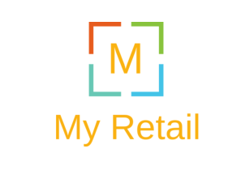
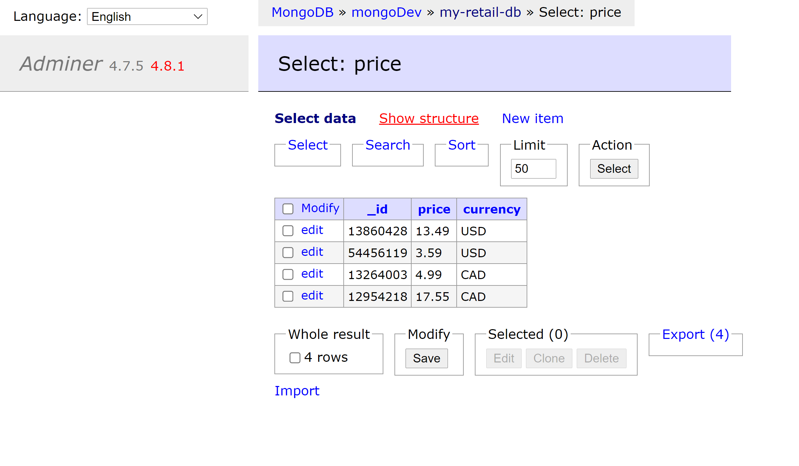
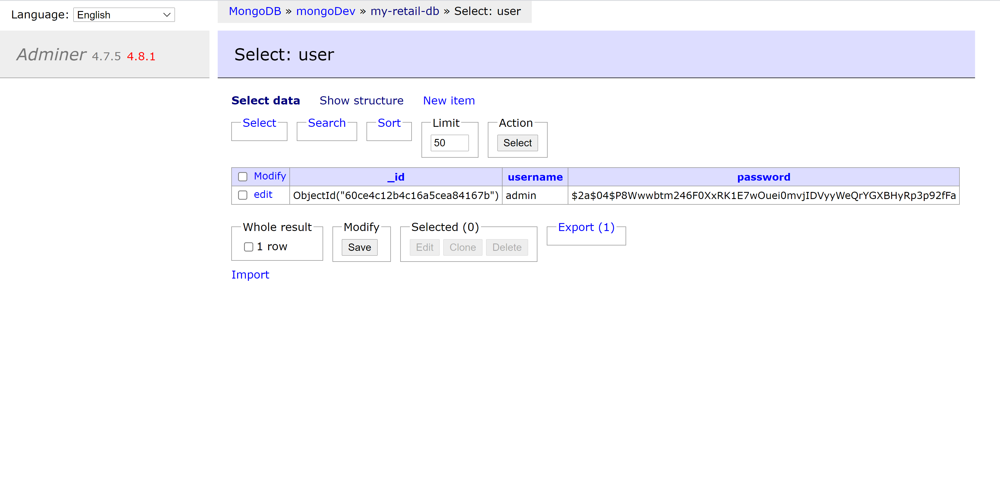

### My Retail
The myRetail RESTful service is a technical assessment case study for a Software Engineer position at Target.

The goal of this exercise was to create end-to-end Proof-of-Concept for a products API that aggregates product data from multiple sources and returns it as JSON to the caller. 

My solution is a RESTful API written in Java using the Spring framework. It is a 'production ready' POC, featuring seperate development and production databases for a nice development experience, authentication and authorization using JSON Web Tokens, and unit tests peace of mind. I go into more detail about the tech stack and engineering decisions below, but first let's get the application running.

### System Requirements

- [Java 11](https://www.oracle.com/java/technologies/javase-jdk11-downloads.html)
- [Maven](https://maven.apache.org/download.cgi)
- [Docker](https://docs.docker.com/get-docker/)

### Get Started
First, start the development and production databases in docker containers:

    docker-compose up -d

Next, start the application in dev mode. Dev mode simply means the api will be pulling data from the development database:

    mvn

### More Useful Commands

Start the application in prod mode. In prod mode the application will pull data from the production database:

    mvn -Pprod

Run the unit tests. This may alter the data stored in the development database.:

    mvn clean test

Stop the development database container

    docker stop mongo-dev-container
    
Remove the development database container. This is useful if you want to reset the dev database to it's initial state.

    docker rm mongo-dev-container
    
Stop and remove all containers. Do not run this command if you are using the mongo-prod-container in production.

    docker-compose stop && docker-compose rm
    
### Endpoints

#### Get the information for the product with id `{id}`

    GET /products/{id}
    
Example Request:

    curl -X GET http://localhost:8080/products/13860428

Example Response Body:

    {
        "id":13860428,
        "name":"The Big Lebowski (Blu-ray) (Widescreen)",
        "current_price": {
                "value": 13.49,
                "currency_code":"USD"
         }
    }

Notes: 
- If the redsky api returns the product name, but the data is not present in the database, only the id and name fields will be returned.
- If the redsky api does not return the product name, the endpoint will respond with error code `404 Not Found`.

#### Update the price data for the product with id `{id}`

    PUT /products/price/{id}
    
Example Request:

    curl --location --request PUT 'http://localhost:8080/products/price/54456119' \
    --header 'Authorization: Bearer xxx.yyy.zzz' \
    --header 'Content-Type: application/json' \
    --data-raw '{
        "price": 20.21,
        "currency": "CAD"
    }'
    
Example Response Body:

    {
        "id":13860428,
        "name":"The Big Lebowski (Blu-ray) (Widescreen)",
        "current_price": {
                "price": 20.21,
                "currencyCode0":"CAD"
         }
    }

Notes:
- This endpoint requires an `Authorization: Bearer xxx.yyy.zzz` header where `xxx.yyy.zzz` is a JSON Web Token which can be received via the login endpoint.
- The body of the response is the updated object. This is not strictly required by REST, but is there to make life easier for the client.
- The product price is added to the database when it is not already in the database, but is found by the redsky api. The client does not care where the data is stored, from their perspective we are just updating an entry, so this is the most logical result.
- This endpoint returns a 404 if the product is not found by the redsky api.
- I chose this url to be clear that this endpoint can only be used to update price data. It cannot be used to update the name of a product.

#### Login to be able to update price

Example Request:

    curl -i --location --request POST 'http://localhost:8080/login' \
    --header 'Content-Type: application/json' \
    --data-raw '{
        "username": "admin",
        "password": "admin"
    }'
    
Example Response Headers:

    HTTP/1.1 200
    Vary: Origin
    Vary: Access-Control-Request-Method
    Vary: Access-Control-Request-Headers
    Authorization: Bearer xxx.yyy.zzz
    Access-Control-Expose-Headers: Authorization
    
Notes:
- The Authorization header in the response contains the JWT, which must be added as a header in future requests to the `PUT products/price/{id}` endpoint. If you are using a tool like curl or postman, just copy and paste the token into an authorization header in the put request. The tokens are valid for 15 minutes.
- The only valid credentials are username: "admin" and password: "admin" in both development and production.

### NoSQL Database
This application is set up with two mongoDB databases (development and production). Currently both are running in docker containers, but changing the production database to a server or cloud hosted mongoDB database can be done by simply changing the spring data properties in `application-prod.yml`.

The current database set up is intended to make development easy. With a containerized development database it is easy to start up, take down, and reset the database as needed. Additionally, docker allows us to take advantage of the awesome `adminer` a gui used for viewing and intercting with databases.

Once the database is running you can inspect it at: 
[http://localhost:5401/](http://localhost:5401/?mongo=dbMongo&username=dev&db=my-retail-db).
If you are prompted to login make sure to set the following fields:
- System: `MongoDB`
- Server: `mongoDev` (`mongoProd` for production)
- Username: `admin`
- Password: `admin`
- Database: `my-retail-db`

##### Database Design
This is a noSQL database with two collections: **price** and **user**. The **price** collection contains price and currency data, the initialization script creates adds four entries on start up. The **user** collection contains usernames and passwords for users that are authorized to update product prices. The passwords are stored encrypted. The initialization script adds a single user to the database on start up. 
 
### Security
The put endpoint for updating product price information is only avilable to users with credentials saved in the
 user collection of the database. Users are authenticated by sending a request to the `/login` endpoint. If the login request is valid, the user will receive a JSON Web Token that is valid for 15 minutes.

All requests to the `/products/price/{id}` endpoint pass through an authorization filter. If the requests do not contain a valid JWT, the application will respond with a `401 unauthorized` error code.

At this time the `GET` endpoint is unsecured, so users do not need a token to access product data.

### Testing
I focused on testing endpoints using unit tests that cover general use and edge cases.  I chose not to write unit tests for every single class, because then every change could force the developer to re-write a test. Instead, we have working tests for all user facing endpoints. This way developers only need to change/add tests when user facing functionality changes or expands. This allows the tests to remain useful without constant oversight from developers.
